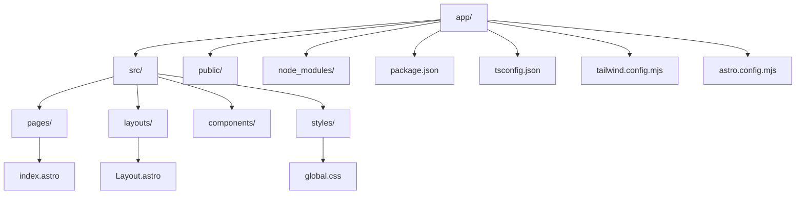

# Astro.js Project Implementation Plan

## 1. Project Setup Overview

We'll create an Astro.js project with Tailwind CSS and strict TypeScript in the `/app` directory. All packages will be installed within the Docker container as requested.

## 2. Docker Environment Verification

The Docker environment is already set up with:
- Node.js 22 slim image
- Volume mapping from `./app` to `/app` in the container
- Working directory set to `/app`

## 3. Implementation Steps

### Step 1: Start the Docker Container
```bash
docker-compose up -d
```

### Step 2: Access the Container Shell
```bash
docker-compose exec app bash
```

### Step 3: Create Astro.js Project with TypeScript
Inside the container:
```bash
# Navigate to the app directory (should be the default working directory)
cd /app

# Create a new Astro project with TypeScript
npm create astro@latest . -- --template=strict
# During the setup:
# - Select "Yes" to install dependencies
# - Select "Strict" TypeScript configuration
# - Choose "Empty" as the starter template
```

### Step 4: Install Tailwind CSS using Astro's Official Integration
```bash
# Install Tailwind CSS using Astro's integration
npx astro add tailwind
# This will:
# - Install required dependencies
# - Set up the Tailwind configuration
# - Create necessary CSS files
# - Update the Astro configuration
```

### Step 5: Update tsconfig.json for Strict TypeScript
Ensure the `tsconfig.json` has strict mode enabled:
```json
{
  "extends": "astro/tsconfigs/strict",
  "compilerOptions": {
    "strictNullChecks": true,
    "strict": true
  }
}
```

### Step 6: Create a Sample Page
Create `src/pages/index.astro`:
```astro
---
import Layout from '../layouts/Layout.astro';
---

<Layout title="Astro + Tailwind + TypeScript">
  <main class="container mx-auto p-4">
    <h1 class="text-4xl font-bold text-blue-600">
      Welcome to Astro with Tailwind CSS and TypeScript
    </h1>
    <p class="mt-4 text-lg">
      This is a starter template with Astro, Tailwind CSS, and strict TypeScript.
    </p>
  </main>
</Layout>
```

### Step 7: Test the Setup
```bash
# Start the development server
npm run dev -- --host 0.0.0.0
```

## 4. Project Structure Diagram



## 5. Docker Compose Configuration Update (Optional)

If we want to expose the Astro development server to the host machine, we can update the `docker-compose.yml` file to include port mapping:

```yaml
version: '3'
services:
  app:
    build: .
    container_name: 1077-app
    volumes:
      - ./app:/app
    working_dir: /app
    tty: true
    stdin_open: true
    ports:
      - "4321:4321"  # Map Astro's default port

networks:
  default:
    name: 1077-network