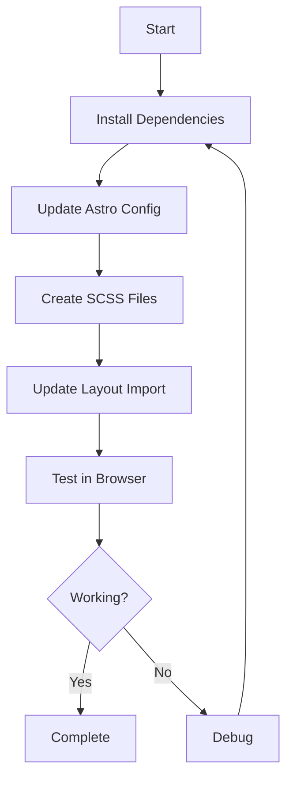

# Implementation Plan: Converting from CSS to SCSS in Astro with Tailwind

## 1. Overview

We'll convert the current CSS setup to SCSS while maintaining Tailwind CSS integration. The implementation will:
- Replace .css files with .scss files
- Configure Astro to process SCSS files
- Maintain Tailwind utility classes in HTML
- Implement SCSS features like variables and nested styles
- Ensure all styles are properly loaded in the application

## 2. Required Dependencies

We need to install the following packages inside the Docker container:
- `sass` - The Dart Sass implementation
- `@astrojs/scss` - Astro integration for SCSS

```mermaid
graph TD
    A[Astro Project] --> B[Install Dependencies]
    B --> C[sass]
    B --> D[@astrojs/scss]
    C --> E[Configure Astro]
    D --> E
    E --> F[Convert CSS to SCSS]
```

## 3. Implementation Steps

### 3.1 Install Required Dependencies

We'll install the necessary packages inside the Docker container:

```bash
docker exec -it 1077-app npm install sass @astrojs/scss --save-dev
```

### 3.2 Update Astro Configuration

We'll update the `astro.config.mjs` file to include SCSS support:

```javascript
// @ts-check
import { defineConfig } from 'astro/config';
import tailwindcss from '@tailwindcss/vite';

// https://astro.build/config
export default defineConfig({
  vite: {
    plugins: [tailwindcss()],
    css: {
      preprocessorOptions: {
        scss: {
          // Optional: Add global SCSS variables here
          // additionalData: `$primary-color: #ff0000;`
        }
      }
    }
  }
});
```

### 3.3 Create SCSS Structure

We'll create the following SCSS file structure:

```
app/src/styles/
├── _variables.scss    # SCSS variables
├── _mixins.scss       # Optional: SCSS mixins
├── global.scss        # Main SCSS file (replaces global.css)
```

### 3.4 Create SCSS Variables File

We'll create a `_variables.scss` file with common variables:

```scss
// Colors
$primary-color: #3b82f6;  // blue-600 in Tailwind
$secondary-color: #0d9488; // teal-600 in Tailwind
$text-color: #111827;     // gray-900 in Tailwind

// Spacing
$spacing-base: 1rem;
$spacing-sm: $spacing-base * 0.5;
$spacing-md: $spacing-base;
$spacing-lg: $spacing-base * 1.5;
$spacing-xl: $spacing-base * 2;

// Breakpoints (matching Tailwind defaults)
$breakpoint-sm: 640px;
$breakpoint-md: 768px;
$breakpoint-lg: 1024px;
$breakpoint-xl: 1280px;
```

### 3.5 Convert global.css to global.scss

We'll convert the existing `global.css` to `global.scss` with the following content:

```scss
@import "variables";
@import "tailwindcss/preflight";
@tailwind utilities;

// Global styles using SCSS features
body {
  font-family: system-ui, sans-serif;
  color: $text-color;
  
  // Nested styles example
  main {
    padding: $spacing-md;
    
    h1 {
      margin-bottom: $spacing-md;
    }
    
    p {
      margin-bottom: $spacing-lg;
    }
  }
}

// Example of a custom component style using SCSS nesting
.custom-button {
  background-color: $primary-color;
  color: white;
  padding: $spacing-sm $spacing-md;
  border-radius: 0.25rem;
  
  &:hover {
    background-color: darken($primary-color, 10%);
  }
  
  &.secondary {
    background-color: $secondary-color;
    
    &:hover {
      background-color: darken($secondary-color, 10%);
    }
  }
}
```

### 3.6 Update Layout.astro

We'll update the import in `Layout.astro` to use the new SCSS file:

```astro
---
import '../styles/global.scss';

interface Props {
  title?: string;
}

const { title = "Astro + Tailwind + TypeScript + SCSS" } = Astro.props;
---
```

### 3.7 Test SCSS Integration

We'll update the `index.astro` file to include a test element using our custom SCSS styles:

```astro
<Layout title="Astro + Tailwind + TypeScript + SCSS">
  <main class="container mx-auto p-4">
    <h1 class="text-4xl font-bold text-blue-600 mb-4">
      Welcome to Astro with Tailwind CSS, TypeScript, and SCSS
    </h1>
    <p class="text-lg mb-6">
      This is a starter template with Astro, Tailwind CSS, SCSS, and strict TypeScript.
    </p>
    <div class="flex gap-4">
      <a href="https://docs.astro.build" class="custom-button">
        Astro Docs
      </a>
      <a href="https://tailwindcss.com/docs" class="custom-button secondary">
        Tailwind Docs
      </a>
      <a href="https://www.typescriptlang.org/docs" class="bg-blue-500 text-white px-4 py-2 rounded hover:bg-blue-600">
        TypeScript Docs
      </a>
    </div>
  </main>
</Layout>
```

## 4. Verification Steps

1. Confirm that the SCSS files are being processed correctly
2. Verify that Tailwind CSS utility classes still work
3. Check that custom SCSS styles (variables and nesting) are applied correctly
4. Ensure the app runs without errors on port 4321



## 5. Rollback Plan

If issues arise, we can revert to the original CSS implementation by:
1. Restoring the original `global.css` file
2. Updating the import in `Layout.astro` back to CSS
3. Removing the SCSS-specific configuration from `astro.config.mjs`